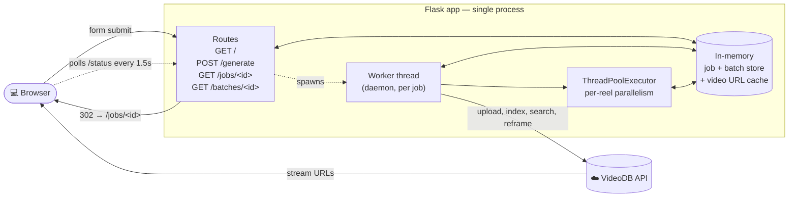

# 🎬 VideoDB Reel Builder

> Turn long-form videos into short, vertical reels — paste a URL, write a few topic queries, watch a rainbow progress bar, get clips you can embed and share.

A small Flask playground built on top of the [VideoDB Python SDK](https://github.com/video-db/videodb-python). Designed to be readable in a single sitting and easy to fork.

---

## Table of contents

1. [Features](#-features)
2. [Quick start](#-quick-start)
3. [Walkthrough](#-walkthrough)
4. [Architecture](#-architecture)
5. [Pipeline](#-pipeline)
6. [Project structure](#-project-structure)
7. [Configuration](#%EF%B8%8F-configuration)
8. [Writing good queries](#-writing-good-queries)
9. [Limits & known issues](#-limits--known-issues)
10. [Troubleshooting](#-troubleshooting)
11. [How it works](#-how-it-works-under-the-hood)
12. [Tech stack](#%EF%B8%8F-tech-stack)

---

## ✨ Features

- **Multi-video batches** — submit many videos in one form; each becomes its own job, all run in parallel.
- **Per-query reels** — one short topic per line ⇒ one reel; up to 5 reels per video reframe concurrently.
- **Multiple languages** — English / Hindi / Hinglish for the spoken-word index, so non-English content actually gets transcribed.
- **Configurable output** — 9:16 vertical / 1:1 square / 16:9 landscape; smart object-tracking or simple centre crop.
- **Live progress** — animated rainbow gradient bar with per-phase milestones; auto-retries reframe once on processing timeouts.
- **Dark mode** — auto-follows OS preference, with a toggle that persists per-browser. No flash-of-incorrect-theme.
- **Friendly errors** — sentence-style queries are caught before they fail; SDK timeouts surface phase-aware actionable messages.
- **XSS-safe** — all dynamic UI is built with `textContent`/`createElement`, never `innerHTML`.

## 🚀 Quick start

You'll need Python 3.10+ and a VideoDB API key.

```bash
# 1. Clone
git clone https://github.com/ygit/videodb-demo
cd videodb-demo

# 2. Get a free API key (50 free uploads, no credit card)
# https://console.videodb.io
cp .env.example .env
# then edit .env and set VIDEO_DB_API_KEY=your-key-here

# 3. Install
python3 -m venv .venv
source .venv/bin/activate
pip install -r requirements.txt

# 4. Smoke-test the SDK connection
python main.py
# → Connected to collection: <name> (<id>)
# → Videos: 0

# 5. Run the UI
flask --app app run --host 127.0.0.1 --port 5057
```

Open <http://127.0.0.1:5057>.

> 💡 **Why port 5057 instead of 5000?** Modern macOS hijacks port 5000 for AirPlay Receiver (Control Center). Pick any free port; 5057 is uncommon enough to almost always be available.

## 🎬 Walkthrough

```
┌─────────────────────────────────────────────────────────────┐
│  🌈 (rainbow brand bar)                              ☾ ◀ toggle│
├─────────────────────────────────────────────────────────────┤
│                                                             │
│  Reel builder           ◀── gradient hero title             │
│  Generate short reels from one or more long-form videos.    │
│                                                             │
│  ▸ How to write good queries                                │
│                                                             │
│  ┌──────────── Video 1 ──────────────────────────────── × ┐ │
│  │  Video URL                                              │ │
│  │  [ https://youtube.com/watch?v=...                  ]   │ │
│  │  Queries · one per line · one reel per line             │ │
│  │  ⓘ One short topic per line, e.g. `key highlights`.     │ │
│  │  ┌─────────────────────────────────────────────────┐    │ │
│  │  │ intro                                           │    │ │
│  │  │ key insight                                     │    │ │
│  │  │ demo                                            │    │ │
│  │  └─────────────────────────────────────────────────┘    │ │
│  └─────────────────────────────────────────────────────────┘ │
│  + Add another video                                        │
│                                                             │
│  Shared settings                                            │
│  Length: [60]   Aspect: ◉ 9:16  ◯ 1:1  ◯ 16:9                │
│                 Mode:   ◉ smart ◯ simple                    │
│                 Lang:   ◉ English ◯ Hindi ◯ Hinglish        │
│                                                             │
│  [ Generate reels ]                                         │
└─────────────────────────────────────────────────────────────┘
```

**The flow:**

1. Paste a video URL — YouTube, Vimeo, or any direct video URL VideoDB can ingest.
2. Write **one topic per line** in the queries box. Each line becomes one reel.
3. (Optional) Click **+ Add another video** to bundle multiple sources into one batch.
4. Pick your output settings — they apply to every reel in the batch.
5. Submit. You're redirected to a live status page that polls every 1.5s.
6. Each reel shows up inline as it finishes. Click to play, or open in the VideoDB player.

## 🏗️ Architecture



**Key pieces:**

- **`app.py`** — all routes, the in-memory job store (a `dict` guarded by `threading.Lock`), the per-job worker, and the shared video URL cache (so repeat submits of the same URL skip re-upload).
- **`templates/_base.html`** — shared layout: brand bar, hero, theme toggle, footer. Other templates extend this.
- **`static/job.js`** — shared rendering for both single-job and batch pages: progress bar, milestones, per-reel cards. Polls in a loop until the job reaches a terminal state.

## 🔄 Pipeline

```mermaid
sequenceDiagram
    autonumber
    participant U as User
    participant F as Flask
    participant W as Worker
    participant V as VideoDB

    U->>F: POST /generate (URL + queries)
    F->>F: Validate (URL, sentence-detection,<br/>length, aspect, mode, lang)
    F->>W: Spawn daemon thread per video
    F-->>U: 302 → /jobs/&lt;id&gt; or /batches/&lt;id&gt;

    par Worker pipeline
        Note over W,V: phase = uploading
        W->>V: collection.upload(url)
        V-->>W: video_id
        Note over W,V: phase = indexing
        W->>V: index_spoken_words(language_code)
        V-->>W: indexed
        Note over W,V: phase = reeling — up to 5 in parallel
        loop each query
            W->>V: video.search(query)
            V-->>W: shots
            W->>W: widen window to length seconds
            W->>V: video.reframe(start, end, target, mode)
            V-->>W: stream_url
            opt reframe stuck
                W->>V: retry once
                V-->>W: stream_url
            end
        end
    and Browser polls
        loop every 1.5s until terminal
            U->>F: GET /jobs/&lt;id&gt;/status
            F-->>U: { state, progress%, reels[] }
            U->>U: render rainbow bar + reel cards
        end
    end
```

**Phase model:** `queued → uploading → indexing → reeling → done`
- On error, `failed_phase` is captured so the UI can mark the right milestone with a red ✗.
- Per-reel state moves through `pending → matching → reframing → ready` (or `skipped` / `error`).

## 📁 Project structure

```
videodb-demo/
├── app.py                  # Flask app: routes, job store, worker pipeline, helpers
├── main.py                 # Smoke test: connect and list videos
├── requirements.txt        # videodb, python-dotenv, flask
├── .env                    # VIDEO_DB_API_KEY (gitignored)
├── .env.example            # template for new clones
├── README.md               # this file
├── templates/
│   ├── _base.html          # shared layout: brand bar, hero, theme toggle, footer
│   ├── index.html          # form: dynamic video blocks + shared settings
│   ├── job.html            # single-job status page
│   └── batch.html          # multi-video batch status page
└── static/
    ├── style.css           # design tokens, light/dark themes, animations
    ├── job.js              # progress bar, milestones, reel rendering, polling
    └── theme.js            # dark-mode persistence + OS preference
```

## ⚙️ Configuration

### Required environment variable

| Variable | Required | Notes |
|----------|----------|-------|
| `VIDEO_DB_API_KEY` | yes | Get a free key at [console.videodb.io](https://console.videodb.io) |

The app reads `.env` from the working directory at startup via `python-dotenv`.

### Knobs in `app.py`

| Constant / route field | Default | Purpose |
|------------------------|---------|---------|
| `MAX_REEL_CONCURRENCY` | `5` | Cap on parallel reframe calls per job |
| `ASPECT_MAP` | 3 entries | UI labels (`9:16` / `1:1` / `16:9`) → VideoDB reframe presets (`vertical` / `square` / `landscape`) |
| `LANGUAGES` | 3 entries | UI labels → `(display_name, language_code)`. `Hinglish` maps to the Hindi code path because VideoDB has no documented code-switched language code. |
| Length input | 60s, range `[5, 300]` | Each reel is widened symmetrically around the matched shot's midpoint |
| `TEMPLATES_AUTO_RELOAD` | `True` | Template edits show on next request without a server restart |

## 💡 Writing good queries

Each line in the queries box is a **separate semantic search** against the spoken-word transcript. Think about what the speaker would actually *say*, not how you'd describe what you want.

| ✓ Works well | ✗ Avoid |
|--------------|---------|
| `match highlights` | `give me key highlights, predictions, coach, transfer market & some laughing moments.` |
| `goal celebration` | `show me everything funny in this video` |
| `funny moment` | `make me a fun reel about football transfers` |
| `transfer rumour` | a single line longer than ~12 words |
| `post-match interview` | sentences with `give me`, `show me`, `find me` openers |

The form catches the most common mistake (one long sentence asking for many things) before it ever reaches VideoDB. If your query gets rejected with *"that looks like one long sentence — split it"*, that's why.

**Other tips:**

- **Match the speaker's vocabulary.** If commentators say "best moments", `best moments` will hit better than abstract synonyms.
- **Pick the right language.** If the audio is Hindi or Hinglish but you submit with English selected, the transcript will be sparse and English queries won't match. Switch the language radio.
- **Short videos are reliable.** Free-tier processing has time limits — see Limits below.

## 🚧 Limits & known issues

| Limit | Notes |
|-------|-------|
| **Max video length: 3 hours** | Free-tier upload cap. Longer videos return *"Video is over 3 hours, please reachout to contact@videodb.io to increase the quota"*. Email them or trim before uploading. |
| **50 free uploads** | Resets per-account; check [console.videodb.io](https://console.videodb.io) for current usage. Easy to burn through if you make the URL public — see deployment notes below. |
| **Reframe timeout** | The SDK can give up with *"Stuck on processing status"* on long source videos. The app retries once automatically, then surfaces a phase-aware actionable message. |
| **In-memory state** | Job and batch state lives in process memory. Flask restart = jobs in flight are lost. Don't deploy this as-is. |
| **Single-process** | The current design assumes one worker. Multi-worker `gunicorn` would need Redis-backed state — out of scope for this playground. |

## 🩺 Troubleshooting

**`Address already in use` on port 5000 (macOS)**
Modern macOS uses port 5000 for AirPlay Receiver. Use a different port (`--port 5057`) or disable AirPlay Receiver in *System Settings → General → AirDrop & Handoff*.

**`AuthenticationError: Authentication failed`**
Your `VIDEO_DB_API_KEY` is missing or wrong. Confirm `.env` exists and contains `VIDEO_DB_API_KEY=...`. Restart the server after editing.

**Job state shows "failed" with no detail**
Check the Flask process logs — the full SDK traceback is logged via `log.exception(...)`. The UI message is intentionally generic for non-VideoDB exceptions to avoid leaking internals; the logs have the truth.

**All reels skip with "no match"**
The query didn't semantically match the transcript. See [Writing good queries](#-writing-good-queries). If the audio language is wrong, fix the language radio. If the video has very little speech, no query will match.

**Form rejects my query as "looks like one long sentence"**
That's the friendly server-side guard. Split your topics into multiple lines.

**Job goes to "failed" during reframe**
The SDK couldn't keep up with VideoDB's processing. The app already retries once. If both attempts fail, the message will tell you to try a shorter source video or contact VideoDB support.

## 🔧 How it works under the hood

A few non-obvious choices worth pointing out:

- **`_get_or_upload(url)`** caches by URL with a per-URL `threading.Lock` so simultaneous form submits of the same URL don't race and double-upload. The cache only evicts on a "not found" SDK error — transient errors keep the cached id intact.
- **`_compute_progress(state, reels, failed_phase)`** computes both the rainbow-bar percent (0–100) and the per-step milestone state (`done` / `active` / `pending` / `error`). When a job errors, the bar fills to *the failing phase's percent* (12 / 30 / 70) and the right step gets a red ✗ — instead of the all-grey-with-full-red rendering that earlier versions had.
- **`_looks_like_compound_sentence(qtext)`** catches the most common query mistake: one long sentence containing multiple topics. Three signals: word count > 12, sentence-style opener (`give me`, `show me`, `find me`, etc.), or a separator (`,`, `;`, ` & `, ` and `) combined with > 5 words.
- **`_is_processing_timeout(exc)`** pattern-matches the SDK's *bare* `Exception("Stuck on processing status")` — which isn't a typed `VideodbError` — so we can detect it, retry once via `_reframe_with_retry`, and surface `_processing_timeout_msg(phase)` if it persists.
- **Per-reel rendering is XSS-safe.** `static/job.js` builds DOM exclusively with `textContent` and `createElement`. Earlier versions used `innerHTML` interpolation, which would have executed `<script>` tags inside transcript text or query strings.
- **Inline pre-body theme script** in `_base.html` reads `localStorage.theme` *before* `<body>` parses, so users in dark mode never see a flash of light. The toggle button just flips `data-theme` on `<html>` and persists.

## 🛠️ Tech stack

- **Backend**: Python 3.12, Flask 3, `threading` + `concurrent.futures.ThreadPoolExecutor`
- **Frontend**: Vanilla JavaScript (no framework), Inter font, CSS custom properties for theming
- **Video pipeline**: [VideoDB Python SDK](https://github.com/video-db/videodb-python) (`videodb`)

---

## Adding screenshots

Drop PNGs in `docs/screenshots/` and reference them with `` from this README — they'll render on GitHub. The fastest way to capture them on macOS:

```bash
# install once: brew install --cask shottr
mkdir -p docs/screenshots
# capture region with Cmd+Shift+4 → save into docs/screenshots/
```

---

Built with [VideoDB](https://videodb.io). PRs welcome.
